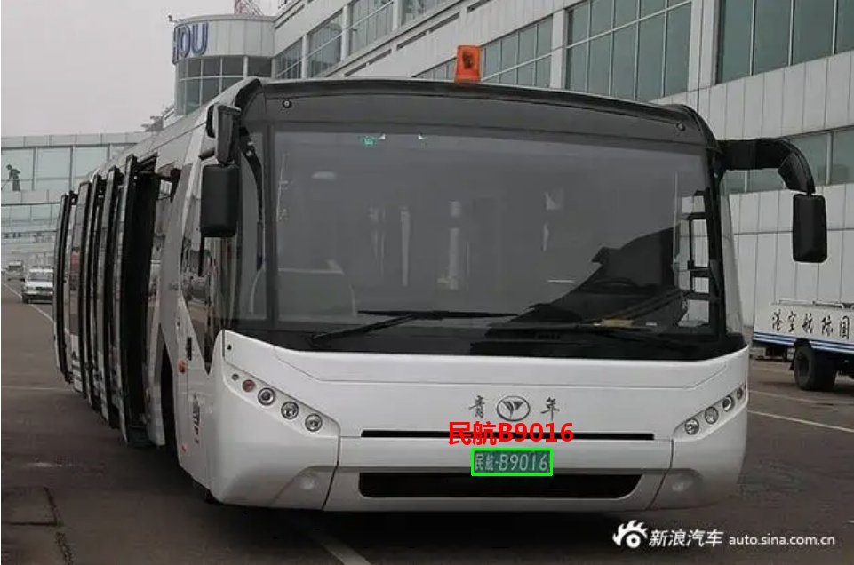

<!-- <big>**史上最全车牌识别算法，支持11种中文车牌类型：**</big> -->

# **最全车牌识别算法，支持11种中文车牌类型**

**1.单行蓝牌**
**2.单行黄牌**
**3.新能源车牌**
**4.白色警用车牌**
**5 教练车牌**
**6 武警车牌**
**7 双层黄牌**
**8 双层武警**
**9 使馆车牌**
**10 港澳牌车**
**11 双层农用车牌**

**12 民航车牌**

## **环境配置**

1.python >=3.6  pytorch >=1.7

运行:

```
python detect_plate.py --detect_model weights/plate_detect.pt  --rec_model weights/plate_rec.pth --image_path imgs --output result
```

测试文件夹imgs，结果保存再 result 文件夹中


2.tensorrt 部署见[tensorrt_plate](https://github.com/we0091234/chinese_plate_tensorrt)

## **车牌检测训练**

参考yolov5-face:

[yolov5-face:](https://github.com/deepcam-cn/yolov5-face)

1. 下载数据集：  [datasets](https://pan.baidu.com/s/1xCYunxRoT3Xv8TeE2t1kPQ) 提取码：trbl     数据从CCPD和CRPD数据集中选取并转换的
   数据集格式为yolo格式：

   ```
   label x y w h  pt1x pt1y pt2x pt2y pt3x pt3y pt4x pt4y
   ```

   关键点依次是（左上，右上，右下，左下）
   坐标都是经过归一化，x,y是中心点除以图片宽高，w,h是框的宽高除以图片宽高，ptx，pty是关键点坐标除以宽高
2. 修改 data/widerface.yaml    train和val路径,换成你的数据路径

   ```
   train: /your/train/path #修改成你的路径
   val: /your/val/path     #修改成你的路径
   # number of classes
   nc: 2                 #这里用的是2分类，0 单层车牌 1 双层车牌

   # class names
   names: [ 'single','double']

   ```
3. ```
   python3 train.py --data data/widerface.yaml --cfg models/yolov5n-0.5.yaml --weights weights/plate_detect.pt --epoch 250
   ```

   结果存在run文件夹中
4. 检测模型  onnx export
   检测模型导出onnx,需要安装onnx-sim  **[onnx-simplifier](https://github.com/daquexian/onnx-simplifier)**

   ```
   1. python export.py --weights ./weights/plate_detect.pt --img 640 --batch 1
   2. onnxsim weights/plate_detect.onnx weights/plate_detect.onnx
   ```

## **车牌识别训练**

车牌识别训练链接如下：

[车牌识别训练](https://github.com/we0091234/crnn_plate_recognition)

**有问题可以提issues 或者加qq群:871797331 询问**

支持如下：

**1.单行蓝牌**


**2.单行黄牌**


**3.新能源车牌**


**4.白色警用车牌**


**5. 教练车牌**


**6. 武警车牌**


**7. 双层黄牌**


**8. 双层武警**


**9. 使馆车牌**


**10. 港牌车**


**11. 双层农用车牌**


**12.民航车牌**


