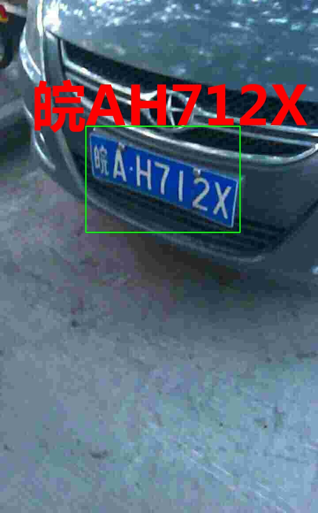

环境配置:

```
pip install -r  requirements.txt
```

运行:

```
python detect_plate.py
```

测试文件夹imgs，结果保存再 result 文件夹中

parser.add_argument('--image_path', type=str, default='imgs', help='source')  # file/folder, 0 for webcam

--image_path 修改为自己的路劲即可

车牌检测参考：

yolov5-face:

[deepcam-cn/yolov5-face: YOLO5Face: Why Reinventing a Face Detector (https://arxiv.org/abs/2105.12931) ECCV Workshops 2022) (github.com)](https://github.com/deepcam-cn/yolov5-face)

车牌识别参考：

crnn:

[bgshih/crnn: Convolutional Recurrent Neural Network (CRNN) for image-based sequence recognition. (github.com)](https://github.com/bgshih/crnn)


支持如下：

1.蓝牌 2.黄牌 3.双层黄牌 4.农用车牌 5 警车 6 校车 7 教练车 8 港澳车牌 9 使领馆 10 武警 11 新能源 12 等等。。。

