 <!-- <big>**史上最全车牌识别算法，支持11种中文车牌类型：**</big> -->

 <b><font size=8 color=red >**史上最全车牌识别算法，支持11种中文车牌类型：**</font></b>

**1.单行蓝牌**
**2.单行黄牌**
**3.新能源车牌** 
**4.白色警用车牌**
**5 教练车牌** 
**6 武警车牌** 
**7 双层黄牌** 
**8 双层武警** 
**9 使馆车牌**
**10 港牌车**
**11 澳牌车**
**12 双层农用车牌** 
 
 
 环境配置:

1.安装其他依赖

```
pip install -r  requirements.txt
```

2.安装 pytorch  gpu 版本和cpu版本都可以   pytorch版本>=1.7

运行:

```
python detect_plate.py
```

测试文件夹imgs，结果保存再 result 文件夹中

parser.add_argument('--image_path', type=str, default='imgs', help='source')  # file/folder, 0 for webcam

--image_path 修改为自己的路劲即可

车牌检测参考：

yolov5-face:

[deepcam-cn/yolov5-face: YOLO5Face: Why Reinventing a Face Detector (https://arxiv.org/abs/2105.12931) ECCV Workshops 2022) (github.com)](https://github.com/deepcam-cn/yolov5-face)

车牌识别参考：

crnn:

[bgshih/crnn: Convolutional Recurrent Neural Network (CRNN) for image-based sequence recognition. (github.com)](https://github.com/bgshih/crnn)

**有问题可以提issues 或者加qq群:871797331 询问**

支持如下：

**1.单行蓝牌**
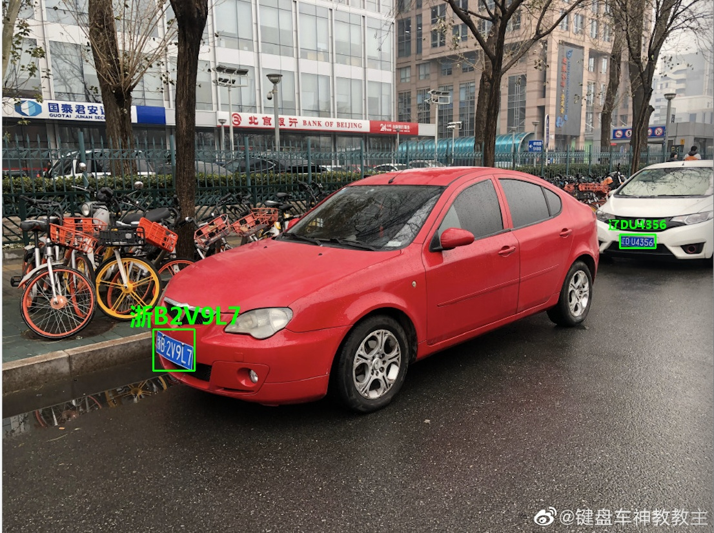

**2.单行黄牌**
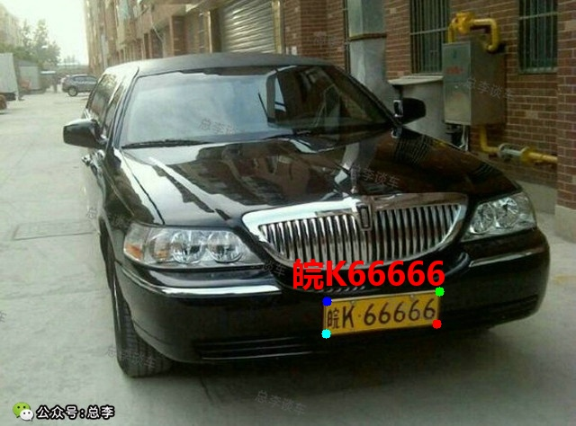

**3.新能源车牌** 
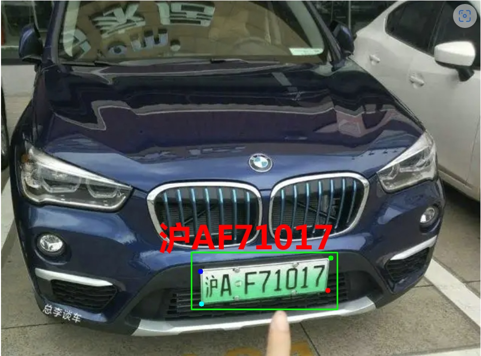

**4.白色警用车牌** 
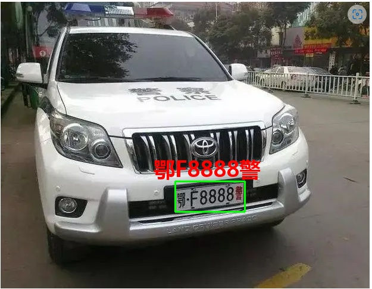

**5. 教练车牌** 
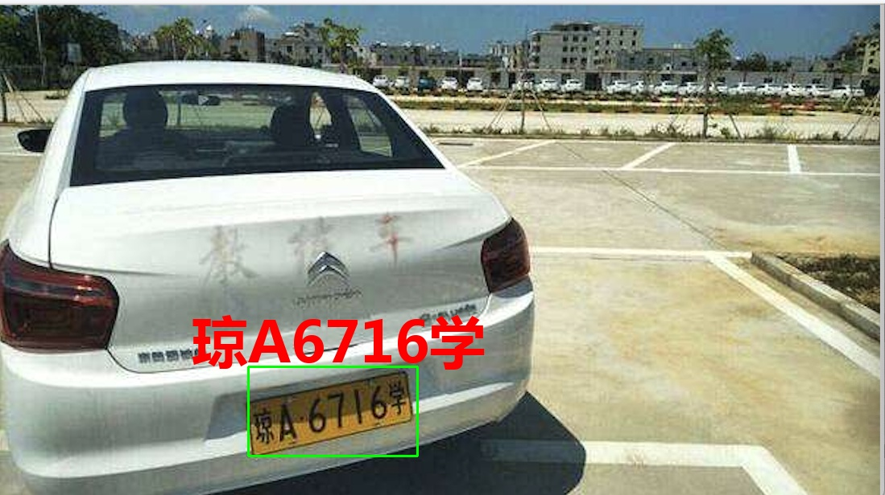

**6. 武警车牌** 
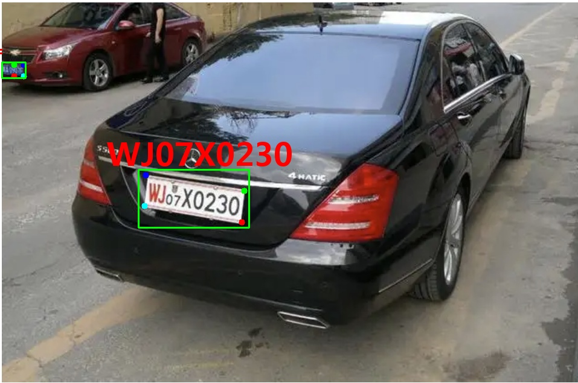

**7. 双层黄牌** 
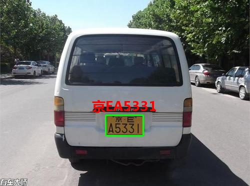

**8. 双层武警** 
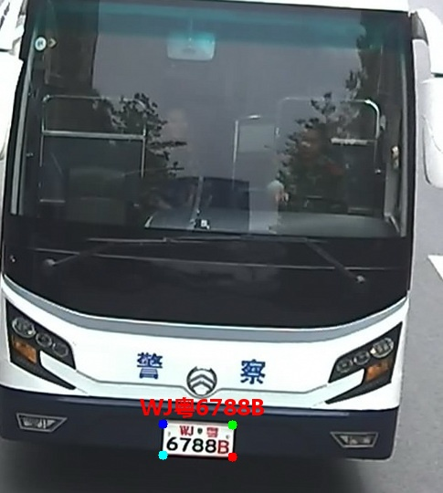

**9. 使馆车牌**
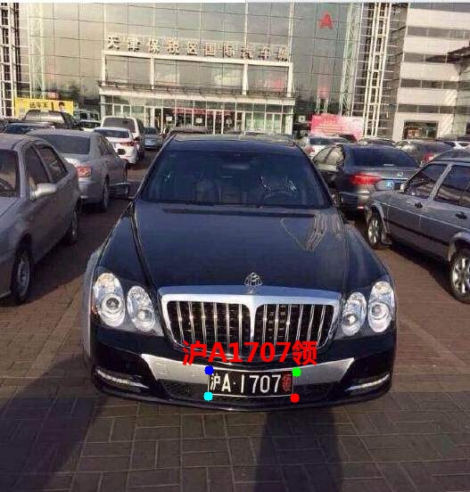

**10. 港牌车**
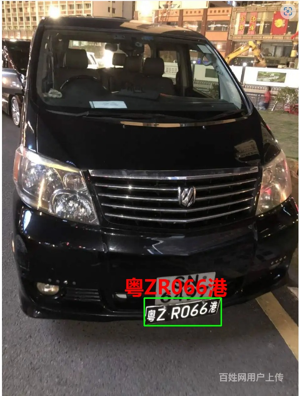


**11. 澳牌车**
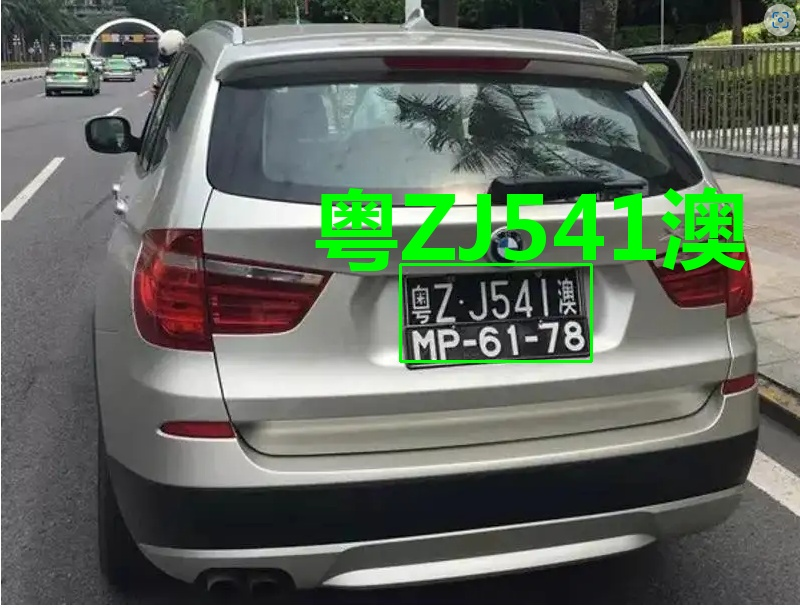

**12. 双层农用车牌** 
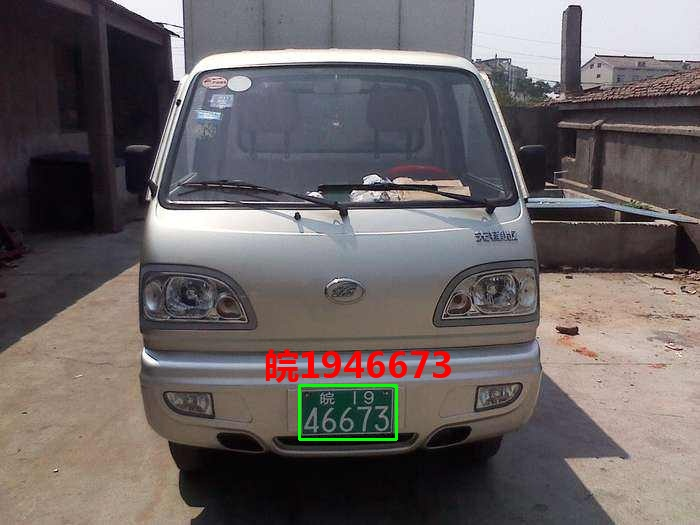

